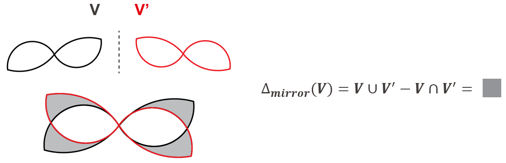
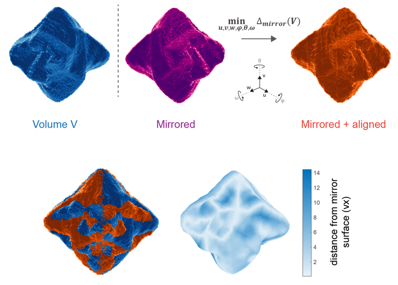

Tools to compute an asymmetry measure using an overlap-based measure (the disjunctive union) or the Hausdorff distance from electron tomography reconstruction - or any voxel-based object. The code can be run from the notebook "asymmetry_3D.ipynb".

If using code or routines from this repository, please cite
- Ha, I. H.\*; Van Gordon, K.\*; Girod, R.\*; Han, J. H.; Vlasov, E.; Baulde, S.; Mosquera, J.; Nam, K. T.; Bals, S.; Liz-Marzán, L. M. Chiroptical Control of Gold Nanoparticle Growth through Combination of a Multimodal Chirality Inducer and Surfactant Counter-Ion. ACS Nano 2025.
- Girod, R.; Vlasov, E.; Liz-Marzán, L. M.; Bals, S. Three-Dimensional Electron Microscopy of Chiral Nanoparticles: From Imaging to Measuring. Nano Lett. 2025, 25 (19), 7629–7640. https://doi.org/10.1021/acs.nanolett.5c01640.

The asymmetry measure quantify how *different* a shape and its mirror image is. Different distance metrics have been proposed for this task. Historically, the Hausdorff distance was well suited for graph-like shapes and molecules, but is slow to compute on voxel-based data. Here, we use the disjunctive union to measure the non-overlaping volume between a shape and its mirror image.

To ensure that it is indeed the difference that is measured and not a misalignement, the chosen metric must be minimized over all translation and rotations to yield a measure of asymmetry

